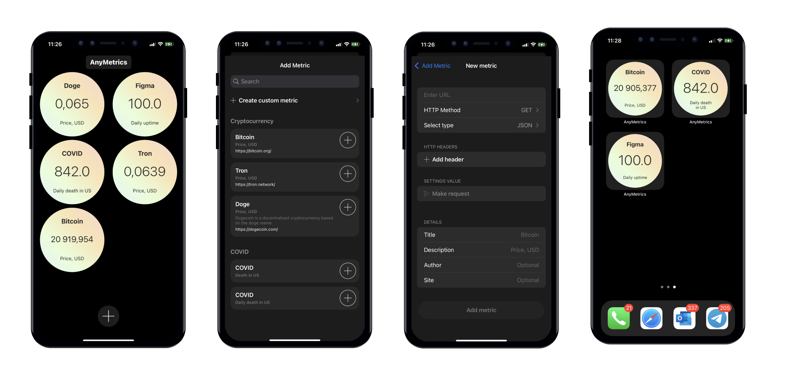

## AnyMetrics

Create the necessary requests to the API or website and get the value from the response and display it in the widget.



### Parse Value

#### JSON


``` json
{
	"data": {
		"items": ["apple", "google", "facebook"]
	}
}
```

Rule: `data.items.1` display: `google`


#### HTML

Use format like `Document.querySelector(selector)`

Example: `div a.link`