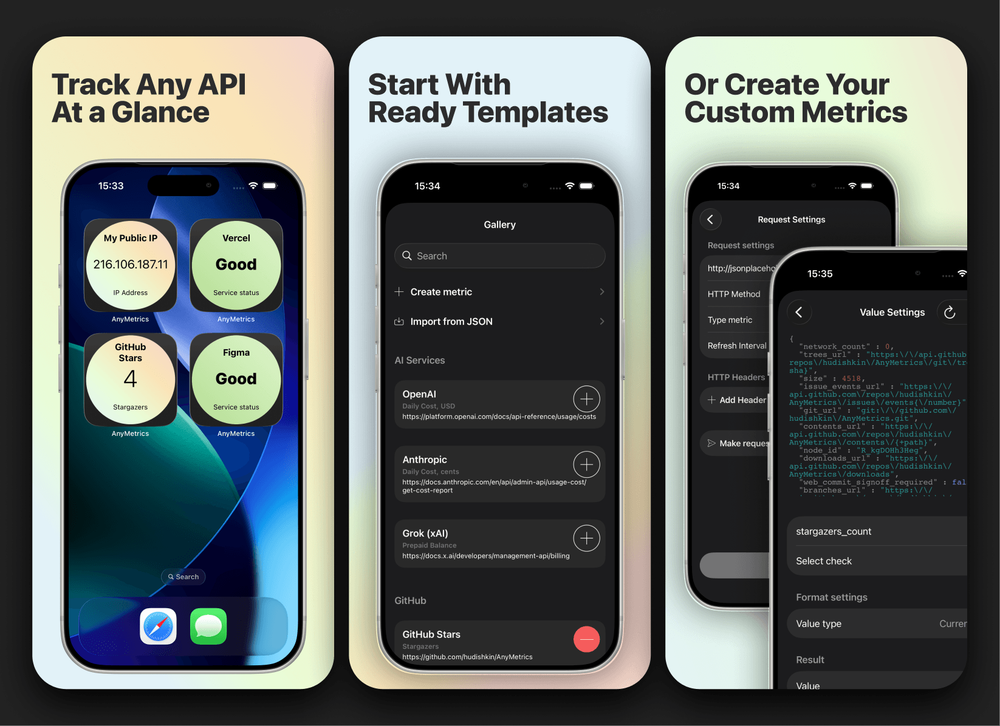

<p align="center">
  
</p>

<h1 align="center">AnyMetrics</h1>

<p align="center">
  <strong>Any HTTP endpoint → a live widget on your iPhone.</strong>
</p>

<p align="center">
  Point AnyMetrics at a REST API, JSON service, or web page.<br />
  Extract the value you care about. Pin it to your Home Screen.<br />
  No code. No servers. No ads.
</p>

<p align="center">
  <a href="https://apps.apple.com/us/app/anymetrics/id1609900961">
    
  </a>
</p>

<p align="center">
  
  
  
  
  
</p>

---

## Why AnyMetrics?

Your APIs already know what’s happening — uptime, deploys, stars, downloads, CI status.  
AnyMetrics turns that into a glanceable Home Screen widget.

| Without AnyMetrics | With AnyMetrics |
|---|---|
| Open dashboards, refresh pages, dig through JSON | One number, always on your Home Screen |
| Custom scripts / scrapers / bots | Configure once in the app |
| Another SaaS to pay for | Free, open source, runs on-device |

---

## How it works

```
1. Request   →  URL, method, headers, timeout
2. Extract   →  JSON path, HTML selector, or HTTP status
3. Widget    →  Pin it. It refreshes on your Home Screen.
```

That’s it. Three steps from endpoint to widget.

---

## What people monitor

- Server uptime & API health
- CI/CD from GitHub, GitLab, Jenkins
- Response times, error rates, deploy status
- Download counts, repo stars, any JSON field
- Scraped values from public HTML pages

---

## Features

| | |
|---|---|
| **Custom HTTP** | Any method, headers, and timeout |
| **JSON parsing** | Dot-paths with filters, aggregates, and selectors |
| **HTML parsing** | CSS selectors (`Document.querySelector` style) |
| **Status checks** | Endpoint health at a glance (`2xx` = OK) |
| **Home Screen widgets** | Compact WidgetKit widgets with live data |
| **Value formatting** | Currency, length trimming, and more |
| **Gallery** | Ready-made metrics — one tap to add |
| **Import / Export** | Share metrics as JSON with your team |

---

## Parsing rules

### JSON

Navigate with a **dot-separated path**.

#### Basic navigation

```json
{
  "data": {
    "items": ["apple", "google", "facebook"]
  }
}
```

| Rule | Result | |
|---|---|---|
| `data.items.1` | `google` | Array index |
| `data.items.0` | `apple` | First element |

#### Aggregates

```json
{
  "users": [
    { "name": "Alice", "age": 25 },
    { "name": "Bob", "age": 30 },
    { "name": "Charlie", "age": 35 }
  ]
}
```

| Op | Meaning | Example | Result |
|---|---|---|---|
| `*+` | Sum | `users.*+.age` | `90` |
| `*avg` | Average | `users.*avg.age` | `30` |
| `*min` | Minimum | `users.*min.age` | `25` |
| `*max` | Maximum | `users.*max.age` | `35` |

#### Selectors

| Op | Meaning | Example | Result |
|---|---|---|---|
| `*first` | First element | `users.*first.name` | `Alice` |
| `*last` | Last element | `users.*last.name` | `Charlie` |
| `*count` | Count | `users.*count` | `3` |

#### Filters

Syntax: `*[field<op>value]`

```json
{
  "servers": [
    { "name": "s1", "status": "online", "cpu": 45 },
    { "name": "s2", "status": "offline", "cpu": 90 },
    { "name": "s3", "status": "online", "cpu": 72 }
  ]
}
```

| Op | Meaning | Example | Result |
|---|---|---|---|
| `=` | Equal | `servers.*[status=online].*count` | `2` |
| `!=` | Not equal | `servers.*[status!=offline].*count` | `2` |
| `>` | Greater | `servers.*[cpu>50].*count` | `2` |
| `<` | Less | `servers.*[cpu<80].*+.cpu` | `117` |
| `>=` | ≥ | `servers.*[cpu>=72].*avg.cpu` | `81` |
| `<=` | ≤ | `servers.*[cpu<=45].*first.name` | `s1` |

#### Chain them

Filters, selectors, and aggregates compose:

```text
servers.*[status=online].*avg.cpu   →  58
servers.*[cpu>50].*last.name        →  s3
servers.*[status=online].*max.cpu   →  72
```

### HTML

Same idea as `Document.querySelector(selector)`.

```text
div a.link
```

---

## Links

- [App Store](https://apps.apple.com/us/app/anymetrics/id1609900961)
- [Community Gallery](https://github.com/hudishkin/AnyMetricsGallery) — ready-made metrics from the community

---

## Build from source

**Requirements:** iOS 15.0+, Xcode 15+, [Tuist](https://tuist.io)

```bash
tuist install
tuist generate
```

Open the generated workspace in Xcode and run.

---

## License

Open source. Free to use, share, and contribute.
